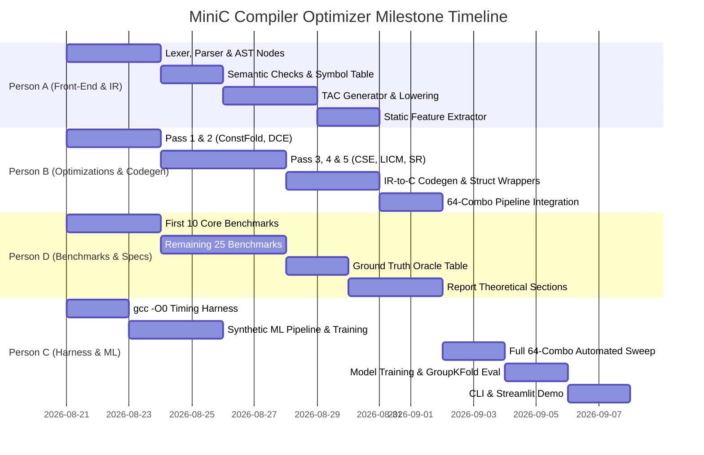

# MiniC Compiler Optimizer — Full End-to-End Implementation Plan
**Project:** AI-Based Compiler Optimization Recommendation System for MiniC  
**Scope:** Complete End-to-End Engineering Specification, Architectural Design, Module Contracts, and Step-by-Step Build Plan.

---

## Table of Contents
1. [System Architecture & Repository Structure](#1-system-architecture--repository-structure)
2. [Data Contracts & Intermediate Representations](#2-data-contracts--intermediate-representations)
   - [2.1 TAC (Three-Address Code) Opcode Specification](#21-tac-three-address-code-opcode-specification)
   - [2.2 Static Feature Vector Specification](#22-static-feature-vector-specification)
   - [2.3 Dataset & Measurement Schema](#23-dataset--measurement-schema)
3. [Component Specifications & Implementation Logic](#3-component-specifications--implementation-logic)
   - [3.1 Front-End (Lexer, Parser, AST, Semantic Checker)](#31-front-end-lexer-parser-ast-semantic-checker)
   - [3.2 TAC Intermediate Representation Generator](#32-tac-intermediate-representation-generator)
   - [3.3 Static Feature Extractor](#33-static-feature-extractor)
   - [3.4 Optimization Engine (5 Toggleable Passes)](#34-optimization-engine-5-toggleable-passes)
   - [3.5 IR-to-C Codegen (Value Semantics Preserving)](#35-ir-to-c-codegen-value-semantics-preserving)
   - [3.6 Benchmark Corpus & Verification Oracle](#36-benchmark-corpus--verification-oracle)
   - [3.7 Timing & Automated Sweep Harness](#37-timing--automated-sweep-harness)
   - [3.8 ML Recommendation Engine](#38-ml-recommendation-engine)
   - [3.9 Interactive Demo (CLI & Streamlit)](#39-interactive-demo-cli--streamlit)
4. [Step-by-Step Phased Execution Plan & Milestones](#4-step-by-step-phased-execution-plan--milestones)
5. [Testing Strategy & Semantic Correctness Gates](#5-testing-strategy--semantic-correctness-gates)
6. [Report & Academic Presentation Structure](#6-report--academic-presentation-structure)

---

## 1. System Architecture & Repository Structure

### 1.1 High-Level Architectural Flow

```
+-----------------------------------------------------------------------------------------+
|                                    OFFLINE PIPELINE                                     |
|                                                                                         |
|  [30-40 MiniC Benchmarks]                                                               |
|           |                                                                             |
|           v                                                                             |
|  [Front-End: Lexer -> Parser -> AST -> Semantic Checks]                                |
|           |                                                                             |
|           +--------------------------------+                                            |
|           |                                |                                            |
|           v                                v                                            |
|  [Static Feature Extractor]      [TAC IR Generator]                                     |
|           |                                |                                            |
|           |                 +--------------+--------------+                             |
|           |                 |  (Sweep all 64 Combos)      |                             |
|           |                 v                             v                             |
|           |         [Combo 0 (Base)]  ...         [Combo 63 (All)]                      |
|           |                 |                             |                             |
|           |                 v                             v                             |
|           |         [IR -> C Codegen]             [IR -> C Codegen]                     |
|           |                 |                             |                             |
|           |                 v                             v                             |
|           |         [gcc -O0 Compile]             [gcc -O0 Compile]                     |
|           |                 |                             |                             |
|           |                 v                             v                             |
|           |         [15-20 Runs Timing]           [15-20 Runs Timing]                   |
|           |                 |                             |                             |
|           +--------> (Dataset Assembly: Features + Combo + Speedup)                     |
|                                    |                                                    |
|                                    v                                                    |
|                        [Train ML Regressor/Classifier]                                  |
|                                    |                                                    |
+------------------------------------+----------------------------------------------------+
                                     | (Trained Model Artifact)
                                     v
+-----------------------------------------------------------------------------------------+
|                                     ONLINE PIPELINE                                     |
|                                                                                         |
|  [New Unseen MiniC Source Code]                                                         |
|           |                                                                             |
|           v                                                                             |
|  [Front-End -> AST -> Static Features]                                                  |
|           |                                                                             |
|           v                                                                             |
|  [ML Model Recommends Optimal Combo (e.g., 0b10110)]                                    |
|           |                                                                             |
|           v                                                                             |
|  [Apply Selected Optimization Passes on TAC IR]                                         |
|           |                                                                             |
|           v                                                                             |
|  [IR -> C Codegen -> gcc -O0 -> Executed Binary]                                        |
|           |                                                                             |
|           v                                                                             |
|  [Report Speedup % vs. Baseline & vs. Brute-Force Best]                                 |
+-----------------------------------------------------------------------------------------+
```

### 1.2 Recommended Repository Directory Structure

```
minic_optimizer/
├── README.md
├── requirements.txt
├── setup.py
├── minic-language-spec.md
├── persons_work_dist.md
├── project-workflow-and-action-plan.md
├── ai-dev-prompts-and-stack.md
│
├── src/
│   └── minic/
│       ├── __init__.py
│       ├── frontend/
│       │   ├── __init__.py
│       │   ├── lexer.py              # Tokenizer & Token dataclass
│       │   ├── tokens.py             # Token types enumeration
│       │   ├── ast_nodes.py          # AST dataclasses
│       │   ├── parser.py             # Recursive-descent parser
│       │   ├── sema.py               # Type checker, symbol table, nominal checks
│       │   └── error_handler.py      # Formatted compile error reporting
│       │
│       ├── ir/
│       │   ├── __init__.py
│       │   ├── tac.py                # TAC instruction types & Operands
│       │   ├── cfg.py                # BasicBlock, CFG builder, Dominator tree
│       │   ├── ir_generator.py       # AST-to-TAC lowering
│       │   └── ir_printer.py         # Human-readable TAC formatter
│       │
│       ├── features/
│       │   ├── __init__.py
│       │   └── extractor.py          # Static feature extraction (AST & TAC metrics)
│       │
│       ├── optimizer/
│       │   ├── __init__.py
│       │   ├── pass_manager.py       # 5-bit pass orchestration engine
│       │   ├── constant_folding.py   # Pass 1: Constant folding & propagation
│       │   ├── dce.py                # Pass 2: Dead code elimination (liveness)
│       │   ├── cse.py                # Pass 3: Common subexpression elimination (LVN)
│       │   ├── licm.py               # Pass 4: Loop-invariant code motion
│       │   └── strength_reduction.py # Pass 5: Strength reduction on induction vars
│       │
│       ├── codegen/
│       │   ├── __init__.py
│       │   └── c_emitter.py          # TAC-to-C emitter with struct wrappers
│       │
│       ├── harness/
│       │   ├── __init__.py
│       │   ├── compiler.py           # Subprocess gcc -O0 wrapper
│       │   ├── timer.py              # High-precision wall-clock timer
│       │   └── sweeper.py            # Automated 64-combo sweep runner
│       │
│       └── ml/
│           ├── __init__.py
│           ├── dataset.py            # Dataset loader & feature matrix builder
│           ├── train.py              # GroupKFold training pipeline
│           ├── model.py              # Model wrapper (RandomForest / GradientBoosting)
│           └── predictor.py          # Online inference & recommendation
│
├── benchmarks/
│   ├── ground_truth.csv              # Reference output oracle table
│   ├── numeric/                      # 2D matrix multiply, convolution, dot products
│   ├── structs/                      # Geometry, particle physics, records
│   ├── strings/                      # Palindrome, reverse, cipher, substring
│   ├── recursion/                    # Fib, factorial, ackermann, tree search
│   └── loops/                        # Intensive LICM / strength-reduction loops
│
├── tests/
│   ├── test_lexer.py
│   ├── test_parser.py
│   ├── test_sema.py
│   ├── test_ir_gen.py
│   ├── test_passes.py                # Unit test for each optimization pass
│   ├── test_codegen.py
│   └── test_correctness.py           # All 64 combos produce identical output
│
├── demo/
│   ├── cli.py                        # minic-opt CLI command
│   └── app.py                        # Streamlit web UI
│
└── data/
    ├── synthetic_dataset.csv         # Fake data for early ML development
    ├── benchmark_dataset.csv         # Real 64-combo timing dataset
    └── trained_model.pkl             # Serialized ML model
```

---

## 2. Data Contracts & Intermediate Representations

### 2.1 TAC (Three-Address Code) Opcode Specification

Every TAC instruction is represented as an instance of `TACInstruction(opcode, dest, src1, src2, annotation)`.

| Opcode | Operands | Description | Example |
|---|---|---|---|
| `ASSIGN` | `dst, src1` | Copy value | `t1 = x` |
| `ADD`, `SUB`, `MUL`, `DIV`, `MOD` | `dst, src1, src2` | Binary arithmetic | `t1 = a + b` |
| `EQ`, `NE`, `LT`, `LE`, `GT`, `GE` | `dst, src1, src2` | Relational test (evaluates to 1 or 0) | `t1 = a < b` |
| `LOGIC_AND`, `LOGIC_OR` | `dst, src1, src2` | Logical operations | `t1 = a && b` |
| `LOGIC_NOT`, `NEG` | `dst, src1` | Unary negation | `t1 = !a`, `t1 = -a` |
| `LABEL` | `label_name` | Control flow target marker | `LABEL L1:` |
| `JUMP` | `target_label` | Unconditional jump | `goto L1` |
| `JUMP_IF_TRUE` | `cond, target_label` | Conditional branch if cond != 0 | `if t1 goto L1` |
| `JUMP_IF_FALSE`| `cond, target_label` | Conditional branch if cond == 0 | `ifFalse t1 goto L1` |
| `PARAM` | `val` | Push argument for function call | `param t1` |
| `CALL` | `dst, func_name, n_args`| Function invocation | `t1 = call fib, 1` |
| `RETURN` | `src1` (optional) | Return from function | `return t1` |
| `LOAD_ARR_1D` | `dst, arr, idx` | Array read `dst = arr[idx]` | `t1 = grid[i]` |
| `STORE_ARR_1D`| `arr, idx, val` | Array write `arr[idx] = val` | `grid[i] = t1` |
| `LOAD_ARR_2D` | `dst, arr, i, j` | 2D Array read `dst = arr[i][j]` | `t1 = m[i][j]` |
| `STORE_ARR_2D`| `arr, i, j, val` | 2D Array write `arr[i][j] = val`| `m[i][j] = t1` |
| `GET_FIELD` | `dst, struct_var, field` | Struct field read | `t1 = p1.x` |
| `SET_FIELD` | `struct_var, field, val` | Struct field write | `p1.x = t1` |

---

### 2.2 Static Feature Vector Specification

The feature extractor produces a numeric vector of **18 static metrics** per program:

| Index | Feature Name | Description | Extraction Source |
|---|---|---|---|
| 0 | `total_instructions` | Total TAC instructions count | TAC |
| 1 | `basic_block_count` | Number of basic blocks in CFG | CFG |
| 2 | `loop_count` | Total count of natural loops | CFG (Back-edges) |
| 3 | `max_loop_depth` | Deepest loop nesting level | AST / CFG |
| 4 | `branch_count` | Number of conditional branches | TAC (`JUMP_IF_*`) |
| 5 | `branch_density` | `branch_count / total_instructions` | Derived |
| 6 | `arithmetic_ops_count` | Sum of `ADD, SUB, MUL, DIV, MOD` | TAC |
| 7 | `multiplication_count` | Number of `MUL` instructions (Strength Reduction signal) | TAC |
| 8 | `constant_load_count` | Number of immediate literal assignments (Const Fold signal) | TAC |
| 9 | `array_access_count` | Total 1D and 2D `LOAD_ARR`/`STORE_ARR` | TAC |
| 10 | `array_2d_access_count`| Total 2D array lookups (LICM / Strength Red signal) | TAC |
| 11 | `struct_access_count` | Total `GET_FIELD` and `SET_FIELD` operations | TAC |
| 12 | `function_call_count` | Number of `CALL` instructions | TAC |
| 13 | `recursive_call_count` | Number of self-referential calls | AST / TAC |
| 14 | `variable_count` | Total number of local variables + temporaries | TAC Symbol Table |
| 15 | `string_ops_count` | Number of string operations | AST / TAC |
| 16 | `instruction_density_in_loops` | TAC instructions inside loops / total instructions | CFG |
| 17 | `cyclomatic_complexity` | `Edges - Nodes + 2` in CFG | CFG |

---

### 2.3 Dataset & Measurement Schema

The automated harness outputs a CSV file with the following columns:

```csv
program_id,f_total_inst,f_bb_count,f_loop_count,f_max_loop_depth,...,f_cyclomatic,combo_id,flag_cf,flag_dce,flag_cse,flag_licm,flag_sr,median_time_ms,speedup_ratio
matrix_mult,420,12,3,2,...,6,0,0,0,0,0,0,320.5,1.0000
matrix_mult,420,12,3,2,...,6,1,1,0,0,0,0,312.1,1.0269
...
matrix_mult,420,12,3,2,...,6,63,1,1,1,1,1,210.4,1.5232
```
* **`combo_id`**: Integer from `0` to `63` representing the 5-bit binary string `b4 b3 b2 b1 b0` where:
  - Bit 0 (`1`): Constant Folding
  - Bit 1 (`2`): Dead Code Elimination
  - Bit 2 (`4`): Common Subexpression Elimination
  - Bit 3 (`8`): Loop-Invariant Code Motion
  - Bit 4 (`16`): Strength Reduction
* **`speedup_ratio`**: $T_{\text{baseline}} / T_{\text{combo}}$ (where $T_{\text{baseline}}$ is combo 0). A value $> 1.0$ indicates acceleration.

---

## 3. Component Specifications & Implementation Logic

### 3.1 Front-End (Lexer, Parser, AST, Semantic Checker)
* **Owner:** Person A
* **Modules:** `src/minic/frontend/`

#### Lexer (`lexer.py`)
- Regular expressions for keywords (`int`, `float`, `char`, `struct`, `if`, `else`, `while`, `for`, `return`).
- Literals: `INT_LIT` (e.g. `123`), `FLOAT_LIT` (e.g. `3.14`), `CHAR_LIT` (e.g. `'a'`), `STRING_LIT` (e.g. `"hello"`).
- Multi-char operators: `==`, `!=`, `<=`, `>=`, `&&`, `||`.
- Maintains line and column positions for diagnostic messages.

#### Parser (`parser.py`)
- Recursive-descent parser matching BNF from [minic-language-spec.md](file:///C:/Users/ashmi/Coding/Projects/minic_optimizer/minic-language-spec.md#L84).
- Supports optional `struct` in type specifiers (`type_spec → 'int' | 'float' | 'char' | 'struct'? IDENT`).
- Operator precedence: `primary` > `postfix` > `unary` > `multiplicative` > `additive` > `relational` > `equality` > `logical AND` > `logical OR` > `assignment`.

#### Semantic Checker (`sema.py`)
- **Symbol Table:** Scoped symbol tables with lexical block resolution.
- **Type Checking:** Ensures operand types match binary operators (e.g. no adding structs).
- **Nominal Struct Resolution:** Struct types are identified strictly by name.
- **Array Dimension Checks:** Validates constant positive integer sizes in declarations and matches 1D/2D subscripts.
- **L-Value Validation:** Rejects invalid left-hand assignment targets (e.g., `func() = 5` or `10 = x`).

---

### 3.2 TAC Intermediate Representation Generator
* **Owner:** Person A
* **Module:** `src/minic/ir/ir_generator.py`

#### Lowering Rules:
1. **Expressions:** Lowered to temporary variables `t1, t2, ...` using post-order tree traversal.
2. **Short-Circuit Logical Operators (`&&`, `||`):** Emits conditional branches and jump labels to preserve short-circuit semantics.
3. **If/Else Statements:**
   ```
   [eval condition -> t1]
   JUMP_IF_FALSE t1, L_else
   [then_block]
   JUMP L_end
   LABEL L_else:
   [else_block]
   LABEL L_end:
   ```
4. **While / For Loops:**
   ```
   LABEL L_loop_start:
   [eval condition -> t1]
   JUMP_IF_FALSE t1, L_loop_end
   [loop_body]
   [for_step]
   JUMP L_loop_start
   LABEL L_loop_end:
   ```
5. **2D Array Indexing:** Lowered using explicit `LOAD_ARR_2D` / `STORE_ARR_2D` opcodes (or flattened to base address offset calculation).
6. **Struct Field Access:** `GET_FIELD dst, struct_var, field_name`.

---

### 3.3 Static Feature Extractor
* **Owner:** Person A
* **Module:** `src/minic/features/extractor.py`

#### Extraction Algorithms:
- **Control Flow Graph (CFG) Construction:**
  1. Identify *leaders* (first instruction, targets of jumps, instructions following jumps).
  2. Partition TAC into basic blocks.
  3. Construct directed edges $(u, v)$ for fall-throughs and jumps.
- **Loop Detection:**
  1. Compute dominators for all basic blocks.
  2. Identify back-edges: an edge $u \rightarrow v$ where $v$ dominates $u$.
  3. Reconstruct natural loops from back-edges to calculate nesting depth and loop-instruction count.
- **Feature Vector Compilation:** Iterates over TAC instructions and AST nodes to output the 18-element numeric array.

---

### 3.4 Optimization Engine (5 Toggleable Passes)
* **Owner:** Person B
* **Module:** `src/minic/optimizer/`

#### Pass 1: Constant Folding & Constant Propagation (`constant_folding.py`)
- **Scope:** Intra-block & global forward propagation.
- **Logic:**
  - If instruction is `t1 = 3 + 5`, replace with `t1 = 8`.
  - Maintain a dictionary of known constant bindings `var -> const_val`.
  - Substitute variables with their constant values when their definition reaches the use site without redefinition.
  - Simplify conditional branches: `if 1 goto L1` $\rightarrow$ `goto L1`; `if 0 goto L1` $\rightarrow$ no-op.

#### Pass 2: Dead Code Elimination (DCE) (`dce.py`)
- **Scope:** Backward liveness analysis across CFG.
- **Logic:**
  - Compute `LiveIn` and `LiveOut` sets for each basic block.
  - An assignment `t = expr` is dead if `t` is not in the live set at that point and `expr` has no side effects (no function call, no memory write).
  - Iterate until no more instructions are removed.

#### Pass 3: Common Subexpression Elimination (CSE) (`cse.py`)
- **Scope:** Local Value Numbering (LVN) per basic block and across extended basic blocks.
- **Logic:**
  - Assign a unique value number to each variable and expression tuple: `(OP, val_src1, val_src2)`.
  - If an expression `(OP, v1, v2)` has already been computed into temporary `t_prev` and neither operand has been mutated, replace `t_curr = src1 OP src2` with `t_curr = t_prev`.

#### Pass 4: Loop-Invariant Code Motion (LICM) (`licm.py`)
- **Scope:** Natural loops in CFG.
- **Logic:**
  1. For each natural loop $L$, find loop-invariant instructions $i: t = a \text{ OP } b$ where operands $a, b$ are either constants or defined outside $L$.
  2. Verify safety criteria:
     - The definition of $t$ dominates all loop exits where $t$ is live.
     - $t$ is not defined elsewhere in the loop.
  3. Create/locate the loop **preheader** block and hoist the instruction into the preheader.

#### Pass 5: Strength Reduction (`strength_reduction.py`)
- **Scope:** Loop induction variables.
- **Logic:**
  1. Identify basic induction variables $i = i + c$ inside loop $L$.
  2. Identify derived induction variables $j = i * k + b$.
  3. Replace the multiplication $j = i * k$ with an auxiliary variable initialized to $i_{\text{init}} * k$ in the preheader and updated by addition $+ (c * k)$ on each loop iteration.

#### Pass Manager (`pass_manager.py`)
- Executes enabled passes in a fixed canonical order:
  $$\text{PassManager}(\text{bitmask}) \rightarrow [\text{CF} \rightarrow \text{CSE} \rightarrow \text{LICM} \rightarrow \text{SR} \rightarrow \text{DCE}]$$
- Runs multiple cleanup sweeps if a transformation exposes new dead code or constant folding opportunities.

---

### 3.5 IR-to-C Codegen (Value Semantics Preserving)
* **Owner:** Person B
* **Module:** `src/minic/codegen/c_emitter.py`

#### Value Semantics & Wrapper Struct Transformation:
In real C, passing an array to a function decays it to a pointer, violating MiniC's zero-aliasing invariant.
Codegen wraps all arrays and strings inside one-field `struct` definitions:

```c
// Emitted C Prelude
#include <stdio.h>
#include <stdlib.h>
#include <string.h>

// Generated typedef wrappers
typedef struct { int data[3][3]; } arr_int_3_3;
typedef struct { char data[6]; } str_6;
typedef struct { int x; int y; } Point;

// Generated functions receive and return structs by value
int matrixSum(arr_int_3_3 m) {
    int total = 0;
    // ...
    return total;
}

int main() {
    // String initialization with C99 compound literals
    str_6 label = (str_6){ .data = "grid1" };
    arr_int_3_3 grid;
    grid.data[0][0] = 1;
    // ...
    return 0;
}
```

---

### 3.6 Benchmark Corpus & Verification Oracle
* **Owner:** Person D
* **Directory:** `benchmarks/`

#### Target Benchmark Suite (35 Total Programs across 5 Categories):
1. **Numerical & 2D Arrays (8 programs):** `matrix_mult`, `matrix_transpose`, `conv2d_3x3`, `lu_decomposition`, `vector_dot_product`, `gaussian_elim`, `image_blur`, `jacobi_iteration`.
2. **Struct & Record Heavy (7 programs):** `point_distance_clustering`, `particle_simulation`, `complex_number_arithmetic`, `bounding_box_collision`, `rgb_to_grayscale`, `ray_sphere_intersect`, `polygon_area`.
3. **String & Character Processing (6 programs):** `palindrome_checker`, `caesar_cipher`, `string_reverse_concat`, `substring_search`, `run_length_encoding`, `levenshtein_distance`.
4. **Recursion & Tree/Graph Traversal (7 programs):** `fibonacci_recursive`, `tower_of_hanoi`, `ackermann_small`, `quicksort_fixed`, `merge_sort_fixed`, `binary_search_tree`, `n_queens_eval`.
5. **Loop Optimization Intensive (7 programs):** `nested_polynomial_eval`, `loop_licm_stress`, `strength_reduction_triangular`, `stencil_1d`, `sum_primes_sieve`, `prefix_sums`, `taylor_series_sin`.

#### Ground Truth Oracle (`ground_truth.csv`):
- Person D runs each benchmark written in standard C compiled with `gcc -O2` to generate the authoritative ground-truth output.
- All 64 pass combinations of our compiler must output the exact same integer/float return value or console output.

---

### 3.7 Timing & Automated Sweep Harness
* **Owner:** Person C
* **Module:** `src/minic/harness/`

#### Measurement Protocol:
1. Emitted C is compiled with `gcc -O0 -o bin_temp.exe program.c`.
2. Execute `bin_temp.exe` using `subprocess.run()`.
3. Repeat **20 runs**:
   - Discard the first 3 runs (warm-up cache / OS page allocation).
   - Take the **median** of the remaining 17 runs using high-resolution monotonic timer `time.perf_counter_ns()`.
4. Record execution time in milliseconds with sub-millisecond precision.
5. Automated sweep iterates over all 35 benchmarks $\times$ 64 combinations = **2,240 rows**.

---

### 3.8 ML Recommendation Engine
* **Owner:** Person C
* **Module:** `src/minic/ml/`

#### Framing Strategy:
- **Regression Framing (Recommended):**
  - Model: `RandomForestRegressor` or `GradientBoostingRegressor`.
  - Input: $X = [\text{18 Static Features}, \text{5 One-Hot Optimization Flags}]$.
  - Output: Predict $\hat{S} = \text{Speedup Ratio}$.
  - Inference: For a new program with features $\vec{f}$, evaluate $\hat{S}(\vec{f}, \text{combo}_k)$ for all $k \in [0..63]$ and pick $k^* = \arg\max_k \hat{S}$.
- **Validation Protocol:**
  - **`GroupKFold(n_splits=5)`** grouped strictly by `program_id`.
  - Prevents data leakage between different optimization combinations of the same benchmark.
- **Evaluation Metrics:**
  - **Speedup Achieved:** Ratio of speedup with predicted combo vs. baseline ($1.0$).
  - **Regret / Optimality Gap:** $S_{\text{oracle-best}} - S_{\text{predicted}}$.
  - **Top-1 Accuracy:** How often the predicted combo matches the true optimal combo within 2% margin.

---

### 3.9 Interactive Demo (CLI & Streamlit)
* **Owner:** Person C
* **Directory:** `demo/`

#### CLI Tool (`cli.py`):
```bash
# Recommend best optimization flags for a MiniC program
python -m minic.demo.cli optimize input.mc --recommend

# Run full benchmark and compare unoptimized vs predicted vs GCC -O3
python -m minic.demo.cli benchmark input.mc
```

#### Streamlit Web App (`app.py`):
- Left Pane: MiniC source code editor + AST / TAC viewer.
- Middle Pane: Feature radar chart (loop depth, basic blocks, arithmetic intensity).
- Right Pane: Model recommendation cards, before/after TAC comparison, live execution timer, and speedup bar chart.

---

## 4. Step-by-Step Phased Execution Plan & Milestones



### Milestone Checklist:
- [ ] **M1 (Day 3): Canonical Example Lowering:** Front-end parses canonical example and emits valid TAC IR.
- [ ] **M2 (Day 5): Individual Pass Validation:** All 5 optimization passes tested and validated on unit TAC blocks.
- [ ] **M3 (Day 8): End-to-End Pipeline Checkpoint:** Canonical example runs through `IR -> Codegen -> gcc -O0` and produces exact return value `83`.
- [ ] **M4 (Day 10): 64-Combo Correctness Sweep:** All 64 optimization combinations verified to yield identical output `83`.
- [ ] **M5 (Day 12): Dataset Collection Complete:** 35 benchmarks swept across all 64 combos $\rightarrow$ 2,240-row dataset generated.
- [ ] **M6 (Day 14): Model Trained & Evaluated:** ML model trained with `GroupKFold`, showing statistically significant speedup on held-out programs.
- [ ] **M7 (Day 15): Demo & Final Report:** Interactive demo operational; project report finalized.

---

## 5. Testing Strategy & Semantic Correctness Gates

```
+-----------------------------------------------------------------------------+
|                          AUTOMATED TESTING MATRIX                           |
+------------------------------------+----------------------------------------+
| Level 1: Unit Tests                | pytest tests/test_lexer.py             |
|                                    | pytest tests/test_parser.py            |
|                                    | pytest tests/test_sema.py              |
|                                    | pytest tests/test_passes.py            |
+------------------------------------+----------------------------------------+
| Level 2: Codegen & Linking Tests   | Emits C code -> compiles with gcc      |
|                                    | Asserts no compiler errors/warnings    |
+------------------------------------+----------------------------------------+
| Level 3: Semantic Invariance Gate  | For EVERY program in benchmarks/:      |
|                                    |   Expected = GroundTruthOracle(prog)   |
|                                    |   For combo in 0..63:                  |
|                                    |     Output = Run(Compile(combo(prog))) |
|                                    |     assert Output == Expected          |
+------------------------------------+----------------------------------------+
```

---

## 6. Report & Academic Presentation Structure

### Final Project Report Sections:
1. **Introduction & Motivation:** The phase-ordering / pass-selection problem in compiler optimization.
2. **MiniC Language Design:** Why pointers and dynamic memory were omitted; formal proof that value semantics guarantee alias-free intermediate representations.
3. **Compiler Architecture:** Front-end parser, TAC opcode design, and value-semantics C codegen wrapper techniques.
4. **Classical Optimization Passes:** Algorithmic details of Constant Folding, DCE, CSE, LICM, and Strength Reduction.
5. **Static Feature Engineering:** Detailed justification for the 18 static features extracted from AST and CFG.
6. **Empirical Dataset & Timing Methodology:** `gcc -O0` isolation, cache warm-up, and sweep automation.
7. **Machine Learning Model & Evaluation:** `GroupKFold` validation, regression vs. classification comparison, feature importance rankings, speedup distribution, and optimality gap.
8. **Demonstration & Conclusion:** CLI/Streamlit interface walkthrough, limitations, and future work.
