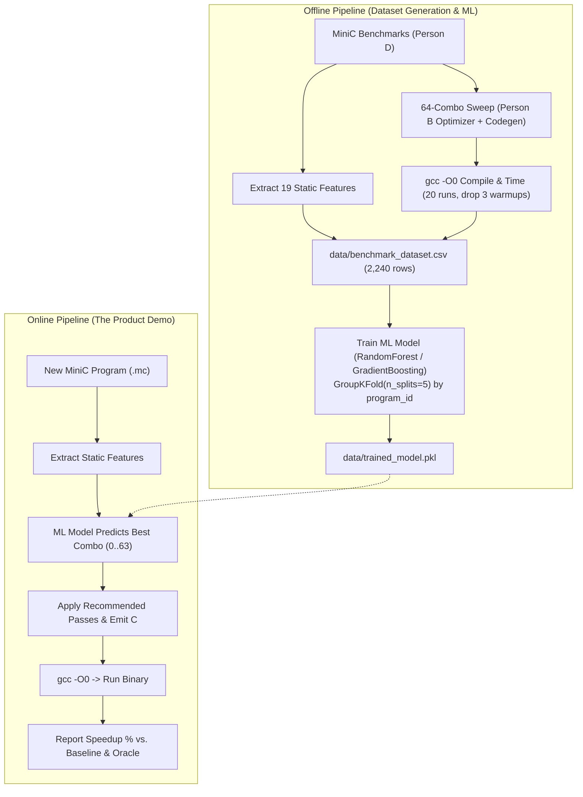

# MiniC Compiler Optimizer — Team Continuation & Handoff Guide
**Project:** AI-Based Compiler Optimization Recommendation System  
**Current Milestone:** **Person A, B and a working Person C pipeline are COMPLETE and VERIFIED end to end.**  
**Remaining:** Person D's fuller benchmark corpus drops into `benchmarks/` with no code change. CLI + browser demos both done.

### Measured result (see [`../../RESULTS.md`](../../RESULTS.md), [`../results.html`](../results.html))

270 benchmarks (30 hand-written + ~240 parametric) emitted to C and compiled
with **`gcc -O0`**, swept over all **64 pass combinations** (6 toggleable passes:
CF, DCE, CSE, LICM, SR, LU) = 17,280 timed configs, every one verified to
reproduce the unoptimized baseline's exit code before its time is recorded.

- Best combo per program: geomean **x1.50**, max x4.57.
- No fixed non-empty combo is safe (each regresses >3% on some program);
  all-6-on is not the per-program best on 243/270 -> the recommender earns its keep.
- Recommender (HGBT + abstain margin x1.12): **x1.23** true speedup on held-out
  programs, 44% of the oracle gain, **9%** of picks regress (21% for plain argmax).

`run_experiment.py` regenerates the bake-off, per-program table, and `RESULTS.md`.

---

## 1. Current State of the Codebase

Front end, IR, 27-feature extractor (19 static + 8 opportunity), 6-pass /
64-combo optimization engine with fixpoint iteration, C codegen, parallel timing
harness, parametric benchmark generator, ML bake-off recommender, CLI + browser
playground -- all operational, `python -m pytest -q` green.

Layout: `src/minic/{frontend,ir,features,optimizer,codegen,harness,ml}`,
`demo/{cli.py,app.py,static/}`, `run_experiment.py`, `benchmarks/`
(+ `benchmarks/generated/`, gitignored). Area ownership:
[`CONTRIBUTIONS.md`](CONTRIBUTIONS.md). Per-role detail:
[`PERSON_B_NOTES.md`](PERSON_B_NOTES.md), [`PERSON_C_NOTES.md`](PERSON_C_NOTES.md).
Repo overview + quickstart: [`../../README.md`](../../README.md).
Pipeline explained stage by stage: [`../WALKTHROUGH.md`](../WALKTHROUGH.md).

```
src/minic/
├── frontend/             # [Person A - Done] Lexer, Parser, AST Nodes, Semantic Analyzer, ASTPrinter
├── ir/                   # [Person A - Done] TAC Opcodes/Operands, CFG, Dominators, Natural Loops, IRPrinter
├── features/             # [Person A - Done] 19-metric Static Feature Extractor
├── optimizer/            # [Person B - Done] 5 Passes + 5-Bit PassManager
│   ├── constant_folding.py   # Pass 1: Constant folding, propagation & branch simplification
│   ├── dce.py                # Pass 2: Dead code elimination via backward liveness & unreachable pruning
│   ├── cse.py                # Pass 3: Common subexpression elimination (LVN per basic block)
│   ├── licm.py               # Pass 4: Loop-invariant code motion (labelled preheader hoisting)
│   ├── strength_reduction.py # Pass 5: Strength reduction on induction variables
│   ├── loop_unroll.py        # Pass 6: Counted-loop unrolling (factor 4 + remainder)
│   └── pass_manager.py       # 6-bit pass engine, fixpoint iteration (combos 0 to 63)
├── codegen/              # [Person B - Done] Value-Semantics IR-to-C Codegen
│   └── c_emitter.py          # Single-field struct wrappers (arr_int_3_3, str_6) & compound literals
└── driver.py             # Unified CLI (--tree, --ast, --tac, --cfg, --features, --optimize, --emit-c, --run)
```

### Complete Python Pipeline Usage (For Person C):
```python
from src.minic.frontend import Lexer, Parser, SemanticAnalyzer
from src.minic.ir import IRGenerator
from src.minic.features import FeatureExtractor
from src.minic.optimizer import optimize_program, get_pass_names
from src.minic.codegen import CEmitter

# 1. Parse & Lower
source = open("canonical_example.mc").read()
ast = Parser(Lexer(source).tokenize(), source).parse()
SemanticAnalyzer(source).analyze(ast)
tac_base = IRGenerator().generate(ast)

# 2. Extract the 27 ML features (19 static + 8 opportunity)
from src.minic.features import all_features
features = all_features(ast, tac_base)

# 3. Optimize with any of the 64 combinations (0 to 63)
combo_mask = 63  # all 6 passes on (CF + DCE + CSE + LICM + SR + LU)
opt_tac = optimize_program(tac_base, combo_mask)

# 4. Emit Value-Semantics C Code
c_code = CEmitter().emit(opt_tac)
```

---

## 2. Person C — Detailed Action Plan & Architecture

* **Goal:** Build the timing harness, automated 64-combo sweeper, train the ML recommendation model with `GroupKFold`, and develop the CLI + browser demo. *(All done.)*
* **Target Directories:** `src/minic/harness/`, `src/minic/ml/`, `demo/`, `data/`



---

### Step-by-Step Build Order for Person C:

### Step 1: Build the Timing & GCC Harness (`src/minic/harness/`)
Create `src/minic/harness/compiler.py` and `src/minic/harness/timer.py`:

1. **`compiler.py`**:
   - Compiles emitted C code using `gcc -O0 -o binary source.c`.
   - Uses `subprocess.run(..., capture_output=True, text=True)`.
   - Captures compilation errors if any and cleans up binary files on completion.

2. **`timer.py`**:
   - Executes the compiled binary **20 times**.
   - **Discards the first 3 runs** (warm-up cache / OS page faults).
   - Measures each run with high-resolution monotonic timer: `time.perf_counter_ns()`.
   - Calculates the **median execution time in milliseconds (`ms`)** across the remaining 17 runs.
   - Asserts exit code matches expected ground truth.

```python
# src/minic/harness/timer.py template:
import time
import subprocess
from typing import Optional, Tuple

def measure_execution_time(bin_path: str, expected_exit_code: Optional[int] = None, runs: int = 20, warmup: int = 3) -> Tuple[float, int]:
    timings = []
    exit_code = 0
    for i in range(runs):
        start = time.perf_counter_ns()
        res = subprocess.run([bin_path], capture_output=True)
        end = time.perf_counter_ns()
        exit_code = res.returncode
        if expected_exit_code is not None and exit_code != expected_exit_code:
            raise RuntimeError(f"Output mismatch: expected {expected_exit_code}, got {exit_code}")
        if i >= warmup:
            timings.append((end - start) / 1_000_000.0)  # ms
    timings.sort()
    median_time = timings[len(timings) // 2]
    return median_time, exit_code
```

---

### Step 2: Build the Synthetic Data Generator (`src/minic/ml/synthetic.py`)
To build and test the ML training pipeline before Person D finishes all 35 benchmarks:
- Generate `data/synthetic_dataset.csv` matching the exact schema with 35 fake programs $\times$ 64 combos = 2,240 rows.
- Give loop-heavy programs higher speedups for LICM (`combo_mask & 8`) and Strength Reduction (`combo_mask & 16`).

---

### Step 3: Automated 64-Combo Sweeper (`src/minic/harness/sweeper.py`)
Iterates over all benchmark programs and sweeps all 64 optimization combinations:
1. For each `.mc` file in `benchmarks/`:
   - Parse and extract 19 static features.
   - For `combo` in `0..63`:
     - Optimize TAC using `optimize_program(tac, combo)`.
     - Emit C source with `CEmitter().emit(opt_tac)`.
     - Compile with `gcc -O0`.
     - Measure `median_time_ms`.
   - Calculate speedup: $\text{Speedup Ratio} = T_{\text{combo 0}} / T_{\text{combo } k}$.
2. Output results to `data/benchmark_dataset.csv`.

#### Dataset Column Schema:
```csv
program_id,category,total_instructions,basic_block_count,loop_count,max_loop_depth,branch_count,branch_density,arithmetic_ops_count,multiplication_count,constant_load_count,array_access_count,array_2d_access_count,struct_access_count,function_call_count,recursive_call_count,named_variable_count,temp_variable_count,string_ops_count,instruction_density_in_loops,cyclomatic_complexity,combo_id,flag_cf,flag_dce,flag_cse,flag_licm,flag_sr,median_time_ms,speedup_ratio
```

---

### Step 4: ML Recommendation Pipeline (`src/minic/ml/`)
Create `src/minic/ml/train.py`, `src/minic/ml/model.py`, and `src/minic/ml/predictor.py`.

#### Crucial Safeguard: GroupKFold Cross-Validation
* **MUST USE `GroupKFold(n_splits=5)` grouped strictly by `program_id`.**
* **Why:** Standard random splits leak data because 64 rows share the exact same 19 static features. `GroupKFold` guarantees entire programs are held out during training and validation.

#### Model Training:
1. Train a `RandomForestRegressor` / `GradientBoostingRegressor` to predict `speedup_ratio`.
   $$X = [\text{19 Static Features}, \text{flag-cf}, \text{flag-dce}, \text{flag-cse}, \text{flag-licm}, \text{flag-sr}]$$
2. Save trained model to `data/trained_model.pkl` using `pickle` / `joblib`.

#### Online Recommendation Function (`src/minic/ml/predictor.py`):
```python
def recommend_combo(features: dict, model) -> Tuple[int, float, List[str]]:
    best_combo = 0
    best_predicted_speedup = -1.0
    
    for combo in range(64):
        flags = [(combo >> 0) & 1, (combo >> 1) & 1, (combo >> 2) & 1, (combo >> 3) & 1, (combo >> 4) & 1]
        x = list(features.values()) + flags
        pred = model.predict([x])[0]
        if pred > best_predicted_speedup:
            best_predicted_speedup = pred
            best_combo = combo
            
    return best_combo, best_predicted_speedup, get_pass_names(best_combo)
```

---

### Step 5: Interactive Demos (`demo/`)

#### 1. CLI Tool (`demo/cli.py`):
```bash
# Recommend best optimization flags for a MiniC file
python3 -m demo.cli optimize canonical_example.mc --recommend

# Run full benchmark and report speedup vs unoptimized baseline
python3 -m demo.cli benchmark canonical_example.mc
```

#### 2. Streamlit Web App (`demo/app.py`):
- **Left Panel:** MiniC source code editor + syntax tree / CFG viewer.
- **Middle Panel:** 19 static features radar chart + loop depth metrics.
- **Right Panel:** ML recommendation card, before/after TAC comparison, live execution speedup bar chart.

---

## 3. Person D — Benchmark Corpus & Oracle Coordination

* **Goal:** Write **30–40 MiniC programs** across 5 categories in `benchmarks/`:
  1. `benchmarks/numeric/` (8 programs): `matrix_mult.mc`, `conv2d_3x3.mc`, `lu_decomposition.mc`, `dot_product.mc`, `gaussian_elim.mc`, `jacobi.mc`, etc.
  2. `benchmarks/structs/` (7 programs): `point_distance.mc`, `particle_sim.mc`, `bounding_box.mc`, `complex_arithmetic.mc`, `polygon_area.mc`, etc.
  3. `benchmarks/strings/` (6 programs): `palindrome.mc`, `caesar_cipher.mc`, `string_reverse.mc`, `substring_search.mc`, `run_length.mc`, etc.
  4. `benchmarks/recursion/` (7 programs): `fibonacci.mc`, `tower_of_hanoi.mc`, `ackermann.mc`, `quicksort.mc`, `merge_sort.mc`, etc.
  5. `benchmarks/loops/` (7 programs): `licm_stress.mc`, `strength_reduction_stress.mc`, `polynomial_eval.mc`, `stencil_1d.mc`, `prime_sieve.mc`, etc.

* **Critical Rule for Person D:** Loop trip counts must be high (thousands to millions of iterations) so execution time under `gcc -O0` is **>100ms**, exceeding clock noise.
* **Ground Truth Oracle:** Provide `benchmarks/ground_truth.csv` with `(program_id, expected_output)`.

---

## 4. Verification Commands for Person C

Person C can run these commands immediately to verify Person A & B's modules:

```bash
# 1. Run full 34-test suite (all green)
python3 -m unittest discover tests

# 2. View visual AST tree
python3 -m src.minic.driver canonical_example.mc --tree

# 3. View visual CFG flowcharts
python3 -m src.minic.driver canonical_example.mc --cfg

# 4. View extracted 19 static features (JSON)
python3 -m src.minic.driver canonical_example.mc --features

# 5. Optimize with combo 63 and run
python3 -m src.minic.driver canonical_example.mc --optimize 63 --run
```
